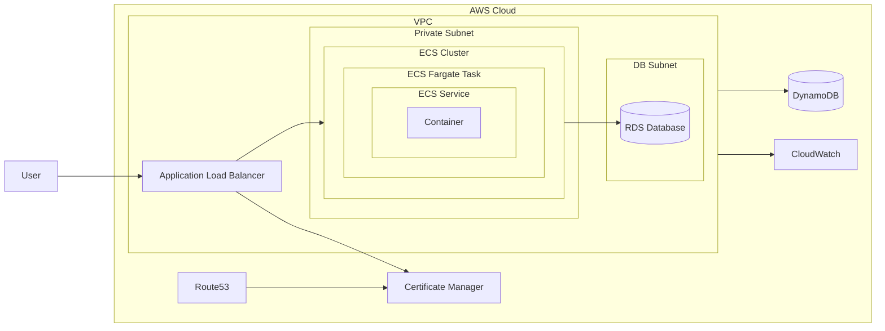

<div align="center">

# Terraform Webapp Infra Module

### Scalable Cloud Infrastructure for Containerized Web Apps

*Deploy scalable cloud web infra in minutes.*

[](LICENSE)
[](https://www.terraform.io/)
[](https://registry.terraform.io/providers/hashicorp/aws/latest/docs)
[](https://registry.terraform.io/providers/hashicorp/google/latest/docs)  
[](https://registry.terraform.io/providers/hashicorp/azurerm/latest/docs)
[](https://docker.com/)

</div>

---

This module provides a robust, modular approach to provisioning cloud infrastructure for containerized web applications using Terraform. It supports multi-cloud deployments and includes reusable components for networking, compute, and managed database resources. Designed for scalability, security, and rapid automation, it helps teams deploy production-grade environments with ease.

## Prerequisites

Before you begin, ensure you have the following installed:

- [Terraform](https://www.terraform.io/downloads.html) v1.5+
- [Docker](https://www.docker.com/) (for local testing)
- Cloud provider CLI (e.g., [AWS CLI](https://aws.amazon.com/cli/), [gcloud](https://cloud.google.com/sdk/docs/install), [Azure CLI](https://docs.microsoft.com/en-us/cli/azure/install-azure-cli))

## Usage

You can use this module to quickly provision infrastructure for your containerized web applications. Below is a minimal example for deploying on AWS:

```hcl
module "webapp_infra" {
  source = "github.com/afnx/terraform-webapp-infra//?ref=v0.0.1"

  deploy_aws = true

  aws_region = "us-west-2"
  aws_tags = {
    Environment = "dev"
    Owner       = "me"
    Project     = "minimal"
  }

  aws_domain_name = "example.com"

  aws_vpc_cidr                = "10.0.0.0/16"
  aws_public_subnet_cidrs     = ["10.0.1.0/24"]
  aws_private_subnet_cidrs    = ["10.0.101.0/24"]
  aws_vpc_flow_logs_role_name = "VPCFlowLogsRole"

  aws_alb_name                       = "myapp-alb"
  aws_alb_security_group_name        = "myapp-alb-sg"
  aws_alb_security_group_description = "My App ALB SG"
  aws_alb_ingress_cidr_blocks_http   = ["0.0.0.0/0"]
  aws_alb_ingress_cidr_blocks_https  = ["0.0.0.0/0"]
  aws_alb_egress_cidr_blocks         = ["0.0.0.0/0"]

  aws_ecs_cluster_name                      = "myapp-ecs-cluster"
  aws_ecs_task_execution_role_name          = "ECSTaskExecutionRole"
  aws_ecs_security_group_name               = "myapp-ecs-sg"
  aws_ecs_security_group_description        = "My App ECS SG"
  aws_ecs_security_group_egress_cidr_blocks = ["0.0.0.0/0"]
  aws_ecs_task_definition_family_name       = "myapp-task-family"
  aws_ecs_service_name                      = "myapp-ecs-service"

  aws_containers = {
    web = {
      image    = "nginx:latest"
      cpu      = 256
      memory   = 512
      port     = 80
      public   = true
      protocol = "HTTPS"
      domain   = "example.com"
    }
  }
}

```

Then run:

```bash
terraform init
terraform plan
terraform apply
```

## Infrastructure Schema

The following diagram illustrates the typical architecture provisioned by this module for a containerized web application on AWS. It includes networking, compute, database, load balancing, and certificate management components and how they interact:



### Component Flow

- **VPC**: Isolated network environment containing public, private, and DB subnets.
- **Route53**: Routes user requests to the Application Load Balancer using a custom domain name.
- **ACM (AWS Certificate Manager)**: Issues SSL certificates for secure HTTPS via the load balancer.
- **ALB (Application Load Balancer)**: Manages incoming HTTP/HTTPS traffic and distributes requests to containers.
- **ECS (Elastic Container Service)**: Runs your containerized web app. Pulls images from ECR or Docker Hub.
- **RDS (Relational Database Service)**: Managed database instance (e.g., PostgreSQL, MySQL) in its own secure subnet.
- **DynamoDB**: Managed NoSQL database for fast key-value or document storage.
- **CloudWatch Logs**: Centralized logging for audit and troubleshooting.
- **User**: Requests flow through ALB, then to ECS containers.

You can adapt or extend this diagram for GCP and Azure deployments as additional modules and integrations become available.

## Examples

This repository includes several example configurations to help you get started:

- **[Basic Webapp Example](./examples/minimal/)**  
  Minimal setup for a containerized web application.

- **[Example with Database](./examples/example-with-database/)**  
  Add a managed database such as RDS or DynamoDB to your infrastructure.

- **[Complete Example](./examples/complete-example/)**  
  Full setup: VPC, ECS, ALB, RDS, security groups.

Explore the [`examples/`](./examples/) directory for more scenarios and copy/adapt them to your needs.

## Supported Providers

| Cloud Provider | Status          | Notes                |
|----------------|-----------------|----------------------|
| AWS            | ✅ Supported    | ECS, RDS, ALB ready  |
| GCP            | 🚧 In Progress | GKE, CloudSQL coming |
| Azure          | 🚧 In Progress | AKS, CosmosDB coming |

## Contributing

We welcome your contributions!

1. Fork the repository
2. Create a feature branch (`git checkout -b feature/amazing-feature`)
3. Commit your changes (`git commit -m 'Add amazing feature'`)
4. Push to the branch (`git push origin feature/amazing-feature`)
5. Open a Pull Request

### Code Style

- **Terraform:** Use `terraform fmt` before committing
- **Modules:** Document inputs/outputs in each module's README

---

## License

This project is licensed under the **MIT License** - see the [LICENSE](LICENSE) file for details.

## Authors

- **Ali Fuat Numanoglu** - *Initial work* - [@afnx](https://github.com/afnx)

## Support

- 🐛 [Report Issues](https://github.com/afnx/terraform-webapp-infra/issues)
- 📧 [Contact Me](https://alifuatnumanoglu.com/contact)
- ⭐ **If this project helped you, please give it a star!**

---

<sub>Made with ❤️ by Ali Fuat Numanoglu</sub>
