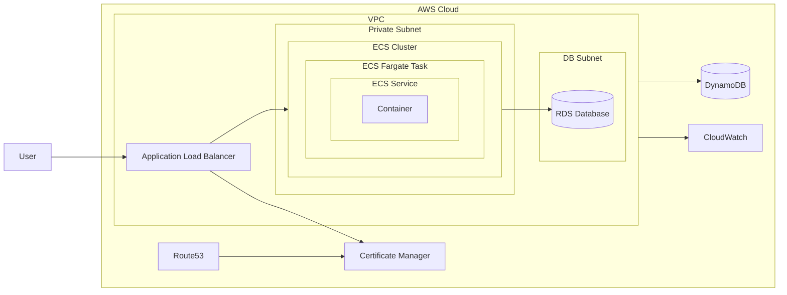

<div align="center">

# Terraform Webapp Infra Module

### Scalable Cloud Infrastructure for Containerized Web Apps

*Deploy scalable cloud web infra in minutes.*

[](LICENSE)
[](https://www.terraform.io/)
[](https://registry.terraform.io/providers/hashicorp/aws/latest/docs)
[](https://registry.terraform.io/providers/hashicorp/google/latest/docs)  
[](https://registry.terraform.io/providers/hashicorp/azurerm/latest/docs)
[](https://docker.com/)

</div>

---

This module provides a robust, modular approach to provisioning cloud infrastructure for containerized web applications using Terraform. It supports multi-cloud deployments and includes reusable components for networking, compute, and managed database resources. Designed for scalability, security, and rapid automation, it helps teams deploy production-grade environments with ease.

## Prerequisites

Before you begin, ensure you have the following installed:

- [Terraform](https://www.terraform.io/downloads.html) v1.5+
- [Docker](https://www.docker.com/) (for local testing)
- Cloud provider CLI (e.g., [AWS CLI](https://aws.amazon.com/cli/), [gcloud](https://cloud.google.com/sdk/docs/install), [Azure CLI](https://docs.microsoft.com/en-us/cli/azure/install-azure-cli))

## Usage

You can use this module to quickly provision infrastructure for your containerized web applications. Below is a minimal example for deploying on AWS:

```hcl
module "webapp_infra" {
  source = "git::https://github.com/afnx/terraform-webapp-infra.git//?ref=v0.0.8"

  deploy_aws = true

  aws_region = "us-west-2"
  aws_tags = {
    Environment = "dev"
    Owner       = "me"
    Project     = "minimal"
  }

  aws_domain_name = "example.com"

  aws_vpc_cidr                  = "10.0.0.0/16"
  aws_public_subnet_cidrs       = ["10.0.1.0/24", "10.0.2.0/24"]
  aws_private_subnet_cidrs      = ["10.0.101.0/24"]
  aws_subnet_availability_zones = ["us-west-2a", "us-west-2b"]
  aws_vpc_flow_logs_role_name   = "VPCFlowLogsRole"

  aws_alb_name                       = "myapp-alb"
  aws_alb_security_group_name        = "myapp-alb-sg"
  aws_alb_security_group_description = "My App ALB SG"
  aws_alb_ingress_cidr_blocks_http   = ["0.0.0.0/0"]
  aws_alb_ingress_cidr_blocks_https  = ["0.0.0.0/0"]
  aws_alb_egress_cidr_blocks         = ["0.0.0.0/0"]

  aws_ecs_cluster_name                      = "myapp-ecs-cluster"
  aws_ecs_task_execution_role_name          = "ECSTaskExecutionRole"
  aws_ecs_security_group_name               = "myapp-ecs-sg"
  aws_ecs_security_group_description        = "My App ECS SG"
  aws_ecs_security_group_egress_cidr_blocks = ["0.0.0.0/0"]
  aws_ecs_task_definition_family_name       = "myapp-task-family"
  aws_ecs_service_name                      = "myapp-ecs-service"

  aws_containers = {
    web = {
      image    = "nginx:latest"
      cpu      = 256
      memory   = 512
      port     = 80
      public   = true
      protocol = "HTTPS"
      domain   = "example.com"
      environment = {
        ENVIRONMENT   = "production"
        LOG_LEVEL     = "info"
        PORT          = "80"
        MY_CUSTOM_VAR = "custom_value"
      }
      secrets = [
        {
          name      = "DB_PASSWORD"
          valueFrom = "arn:aws:secretsmanager:us-west-2:123456789012:secret:db_password"
        },
        {
          name      = "API_KEY"
          valueFrom = "arn:aws:ssm:us-west-2:123456789012:parameter/api_key"
        }
      ]
      autoscaling = {
        min_capacity       = 2
        max_capacity       = 5
        target_cpu         = 70
        scale_in_cooldown  = 60
        scale_out_cooldown = 60
      }
    }
  }
}

```

Then run:

```bash
terraform init
terraform plan
terraform apply
```
> ⚠️ **Important Security Warnings**
>
> - **NEVER HARDCODE SECRETS:**  
>   NEVER HARDCODE SECRETS, PASSWORDS, OR SENSITIVE VALUES DIRECTLY IN TERRAFORM FILES, VARIABLES, OR VERSION CONTROL. ALWAYS USE SECURE REFERENCES.
>
> - **Secrets and Environment Variables:**  
>   Store sensitive values (such as environment variables for containers or database passwords) in a secure service like AWS Secrets Manager or SSM Parameter Store **before** deploying. Reference their ARNs in your module configuration as shown in the example above.
>
> - **Database Passwords:**  
>   When provisioning managed databases (e.g., RDS), create the database password in Secrets Manager or Parameter Store first, and use the ARN in the `rds_password_arn` field.
>
> - **Permissions Required:**  
>   The IAM user or role running Terraform must have permissions to read from Secrets Manager or Parameter Store for any referenced secrets. Ensure you grant these permissions before applying your infrastructure.

## Validating Domain Ownership for AWS Certificate Manager

When creating **public certificates** with AWS Certificate Manager (ACM), AWS must validate that you control the domain. During `terraform apply`, you might see repeated messages like:

```
module.aws_route53[0].aws_acm_certificate_validation.cert_validation: Still creating...
```

This means ACM is waiting for you to complete domain ownership validation. To resolve this:

1. **Go to the [AWS Certificate Manager Console](https://console.aws.amazon.com/acm/home).**
2. Find the certificate Terraform is trying to create (it will be in "Pending validation" state).
3. Expand the certificate details to see the **Domains** section.
4. Add the required DNS validation records (CNAME) to your domains DNS records.
5. Once validation is complete, ACM will issue the certificate and the Terraform apply will finish.
6. For more information, see the [AWS Certificate Manager User Guide](https://docs.aws.amazon.com/acm/latest/userguide/domain-ownership-validation.html).

> **Tip:**  
> DNS validation for ACM public certificates can take up to 30 minutes or more. If you see the message above for an extended time, double-check that the DNS records are present and correct.

## Infrastructure Schema

The following diagram illustrates the typical architecture provisioned by this module for a containerized web application on AWS. It includes networking, compute, database, load balancing, and certificate management components and how they interact:



### Component Flow

- **VPC**: Isolated network environment containing public, private, and DB subnets.
- **Route53**: Routes user requests to the Application Load Balancer using a custom domain name.
- **ACM (AWS Certificate Manager)**: Issues SSL certificates for secure HTTPS via the load balancer.
- **ALB (Application Load Balancer)**: Manages incoming HTTP/HTTPS traffic and distributes requests to containers.
- **ECS (Elastic Container Service)**: Runs your containerized web app. Pulls images from ECR or Docker Hub.
- **RDS (Relational Database Service)**: Managed database instance (e.g., PostgreSQL, MySQL) in its own secure subnet.
- **DynamoDB**: Managed NoSQL database for fast key-value or document storage.
- **CloudWatch Logs**: Centralized logging for audit and troubleshooting.
- **User**: Requests flow through ALB, then to ECS containers.

You can adapt or extend this diagram for GCP and Azure deployments as additional modules and integrations become available.

## Examples

This repository includes several example configurations to help you get started:

- **[Basic Webapp Example](./examples/minimal/)**  
  Minimal setup for a containerized web application.

- **[Example with Database](./examples/example-with-database/)**  
  Add a managed database such as RDS or DynamoDB to your infrastructure.

- **[Complete Example](./examples/complete-example/)**  
  Full setup: VPC, ECS, ALB, RDS, security groups.

Explore the [`examples/`](./examples/) directory for more scenarios and copy/adapt them to your needs.

## Supported Providers

| Cloud Provider | Status          | Notes                |
|----------------|-----------------|----------------------|
| AWS            | ✅ Supported    | ECS, RDS, ALB ready  |
| GCP            | 🚧 In Progress | GKE, CloudSQL coming |
| Azure          | 🚧 In Progress | AKS, CosmosDB coming |

## Contributing

We welcome your contributions!

1. Fork the repository
2. Create a feature branch (`git checkout -b feature/amazing-feature`)
3. Commit your changes (`git commit -m 'Add amazing feature'`)
4. Push to the branch (`git push origin feature/amazing-feature`)
5. Open a Pull Request

### Code Style

- **Terraform:** Use `terraform fmt` before committing
- **Modules:** Document inputs/outputs in each module's README

---

## License

This project is licensed under the **MIT License** - see the [LICENSE](LICENSE) file for details.

## Authors

- **Ali Fuat Numanoglu** - *Initial work* - [@afnx](https://github.com/afnx)

## Support

- 🐛 [Report Issues](https://github.com/afnx/terraform-webapp-infra/issues)
- 📧 [Contact Me](https://alifuatnumanoglu.com/contact)
- ⭐ **If this project helped you, please give it a star!**

---

<sub>Made with ❤️ by Ali Fuat Numanoglu</sub>
